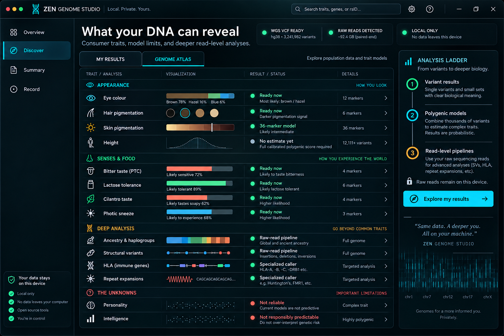
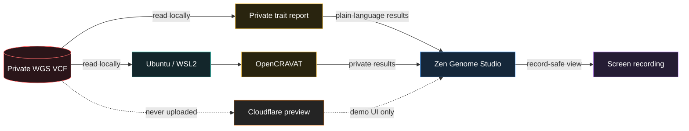
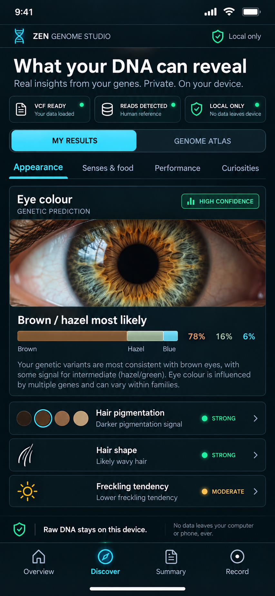

<div align="center">

# 🧬 Zen Genome Studio

### Your genome stays private. Your discoveries get a stage.

A privacy-first visual workspace for exploring everyday genetic traits, reviewing
whole-genome VCFs with [OpenCRAVAT](https://opencravat.org/), and creating polished, record-ready walkthroughs.

[](https://github.com/prestonzen/zen-genome-studio/actions/workflows/ci.yml) [](LICENSE) [](https://react.dev/) [](https://opencravat.org/) [](CLOUDFLARE.md)

**[Quick start](#-quick-start)** · **[How it works](#-how-it-works)** · **[Privacy](#-the-privacy-promise)** · **[Creator mode](#-built-for-the-camera)**

</div>



```text
                 A · T                 C · G
                  ╲ ╱                   ╲ ╱
                   ╳     Z E N           ╳
                  ╱ ╲   G E N O M E     ╱ ╲
                 G · C   S T U D I O   T · A
                    privacy → insight
```

> [!IMPORTANT]
> Zen Genome Studio is for research and education. It does not diagnose disease or replace advice from a qualified clinician or genetic counselor.

## ✨ What is this?

Zen Genome Studio adds a clear, screen-recording-friendly layer to a serious local genomics workflow. Its **Discover** and **Summary** views translate a small, curated set of non-medical markers into everyday language. OpenCRAVAT remains available for expert variant review.

| Experience | What it does | Where your genome goes |
| --- | --- | --- |
| 🖥️ **Local studio** | Connects to a private VCF and launches OpenCRAVAT | Nowhere. It stays on your computer. |
| ☁️ **Cloud preview** | Shows the visual interface with reference/demo content | No upload exists. No genome is received. |
| 🎬 **Record-safe mode** | Hides sensitive details while you capture a walkthrough | Recording remains under your control. |

The local interface never invents personal findings. Its private results appear only after a report has been generated from the configured VCF. The public cloud preview uses clearly labeled fictional examples and has no genome upload route.

## 🗺️ How it works



### Two deliberately separate worlds

```text
┌──────────────────────────── PUBLIC ────────────────────────────┐
│  GitHub source  →  Cloudflare Pages  →  reference-only demo  │
│  No uploads        No findings          Safe to share         │
└────────────────────────────────────────────────────────────────┘

┌──────────────────────────── PRIVATE ───────────────────────────┐
│  Original VCF   →  OpenCRAVAT / WSL2  →  local result viewer │
│  Outside repo      Real annotation        Never auto-shared    │
└────────────────────────────────────────────────────────────────┘
```

## 🚀 Quick start

### 1. Prepare Windows

Install **Ubuntu** from the Microsoft Store, open it once, and create your Linux username and password. Keep raw genome files in a private folder outside this repository.

### 2. Install the workspace

Open PowerShell in the project folder:

```powershell
npm install
powershell -ExecutionPolicy Bypass -File .\scripts\setup-opencravat.ps1
```

The setup creates an isolated Python environment inside Ubuntu and installs OpenCRAVAT, its GRCh38 base data, and a practical starter collection of clinical, pharmacogenomic, trait, visualization, and reporting modules.

> [!NOTE]
> Base reference data alone is about 2 GB. The complete module set needs additional disk space and can take a while to download.

### 3. Point to private data

Create `.env.local` from `.env.example` and set the private source directory and VCF filename. `.env.local` is ignored by Git and must never be committed.

```dotenv
GENOME_DATA_DIR=C:\path\to\private-genome-data
GENOME_VCF_NAME=sample.vcf.gz
GENOME_READS_NAME=sample.fastq.genozip
ANCESTRY_DNA_NAME=AncestryDNA.zip
ANCESTRY_DNA_RELATION=self
OPENCRAVAT_URL=http://127.0.0.1:8080
```

### 4. Launch

```powershell
powershell -ExecutionPolicy Bypass -File .\scripts\start-all.ps1
```

| Local page | Address |
| --- | --- |
| 🎨 Zen Genome Studio | `http://127.0.0.1:4173/` |
| 🔬 OpenCRAVAT | `http://127.0.0.1:8080/` |

Stop both services with:

```powershell
powershell -ExecutionPolicy Bypass -File .\scripts\stop-all.ps1
```

### 5. Build the everyday-traits report

Create a compact private report for the **Discover** and **Summary** screens:

```powershell
powershell -ExecutionPolicy Bypass -File .\scripts\build-private-traits.ps1
```

The report is stored under your private Windows app-data directory, outside the repository. Refresh `http://127.0.0.1:4173/` and open **Discover**. The first `start-all.ps1` launch also builds this report automatically when it is missing.

### 6. Connect a clinician-reviewed report

The **Summary** screen can display carrier and incidental findings from a compact `clinical-report.json` file. This source is deliberately separate from consumer traits and polygenic scores: the studio displays the laboratory's categories and classifications without recalculating them.

1. Copy `docs/clinical-report.example.json` to `%LOCALAPPDATA%\ZenGenomeStudio\private\clinical-report.json`.
2. Transcribe only findings already stated in a clinician-reviewed report. Do not infer or reclassify variants.
3. Open **Summary** and turn off **Record-safe mode** only when you are in private.

The PDF itself stays in your private medical folder. Neither the PDF nor the compact local summary belongs in Git.

### 7. Build a fast OpenCRAVAT preview

Before committing to a multi-hour whole-genome job, create a local preview containing up to 100 real variants from each chromosome or contig:

```powershell
powershell -ExecutionPolicy Bypass -File .\scripts\build-private-preview.ps1
powershell -ExecutionPolicy Bypass -File .\scripts\start-preview-viewer.ps1
```

The derived VCF and SQLite result stay under the private Ubuntu home directory, outside this repository. The original VCF is read-only and unchanged. OpenCRAVAT displays the annotated preview at `http://127.0.0.1:8080/`.

## 🌍 Ancestry layers

The private **Ancestry** workspace keeps two methods visibly separate:

| Layer | What it shows | Source |
| --- | --- | --- |
| **Imported estimate** | Regional percentages and a family comparison exactly as supplied by a consumer ancestry service | Private `ancestry-report.json`; never recalculated or deployed |
| **Open-reference analysis** | Reproducible genetic similarity, PCA placement, and coarse mixture estimates | [1000 Genomes 30x GRCh38](https://www.internationalgenome.org/data-portal/data-collections/1000genomes_30x/) with [PLINK 2](https://www.cog-genomics.org/plink/2.0/strat) |

The open panel is scientifically useful for broad structure and sampled cohorts, but it cannot reproduce proprietary fine-region labels. The interface says **genetic ancestry**, not ethnicity: DNA does not measure culture, nationality, or identity.

Copy `docs/ancestry-report.example.json` to `%LOCALAPPDATA%\ZenGenomeStudio\private\ancestry-report.json` to connect an imported estimate. Real profiles must remain outside Git.

## ✨ Everyday discovery



The first consumer report deliberately stays small and explainable:

| Area | Current results | How to read them |
| --- | --- | --- |
| 👁️ Appearance | IrisPlex eye-colour probabilities, hair pigmentation, freckling signal | Eye colour has the strongest validated model; hair and freckling remain multi-gene tendencies. |
| ☕ Senses & food | Lactase persistence, caffeine, bitter taste, earwax, cilantro, ALDH2 | Some are strong single-marker traits; others are useful clues with environmental modifiers. |
| 🏃 Performance | ACTN3 protein status and caffeine-response marker | Exploratory only. These do not prescribe training or predict athletic talent. |
| 💡 Curiosities | Bright-light sneeze marker | A fun odds-shifting association, not a deterministic result. |

Every result includes an evidence grade, direct-marker coverage, plain-language explanation, and research source. **Evidence first** hides low-predictive associations; **Explore associations** deliberately reveals them with an Exploratory label. Percentages appear only when a validated model actually produces one, such as IrisPlex, rather than turning weak evidence into fake precision. Read the full [trait methodology and limitations](docs/TRAIT-METHODOLOGY.md).

The expanded **Genome Atlas** also inventories analyses that need the full model or raw read evidence: mitochondrial and Y haplogroups, structural variants, HLA, repeat expansions, pharmacogenomics, blood groups, kinship, runs of homozygosity, sleep chronotype, body composition, and blood-cell scores. See the [discovery source map](docs/DISCOVERY-SOURCES.md) for the evidence boundary and recommended tools.

### 🧭 Interactive overview

The Overview is a working explorer rather than a decorative chromosome plot:

- **Genome map** - select a chromosome, then open a curated gene or region to see its biology, limitations, source, and related local trait result.
- **Polygenic** - compare height, skin pigmentation, chronotype, and body-composition model readiness without inventing a personal score.
- **Data layers** - inspect the separate roles of the whole-genome VCF, compressed reads, optional AncestryDNA microarray, and public PGS Catalog models.
- **Analysis tools** - select **Open tool check**, then **Check tools** to test Ubuntu for the private read, alignment, variant, and polygenic toolchain without uploading or installing anything.

These layers remain separate until genome build, strand orientation, effect alleles, and missing coverage have been reconciled. AncestryDNA can confirm some overlapping rsIDs, while the WGS data remains the broader source.

### 🧭 Genome Atlas

The **Genome Atlas** answers a different question: *what else could this dataset support?*

| Readiness | Examples | Meaning |
| --- | --- | --- |
| ✅ **Ready now** | Eye colour, bitter taste, lactose, cilantro | A compact result can be calculated from the current VCF. |
| 📊 **Full model** | Skin pigmentation, height | A validated multi-marker or polygenic model must be implemented before showing a result. |
| 🧬 **Read pipeline** | Ancestry, haplogroups, structural variants | The raw sequencing reads add information beyond the small-variant VCF. |
| 🔬 **Specialized** | HLA, repeat expansions | A purpose-built caller and careful validation are required. |
| ⛔ **Not reliable** | Personality, intelligence | Current genetics should not be turned into an individual score. |

Height is intentionally shown as **No estimate yet**. The largest height map contains more than 12,000 independently associated variants; cherry-picking a few would create fake precision. Skin pigmentation is likewise held until the complete 36-marker HIrisPlex-S model is available.

### 📊 Add a PGS Catalog model

Open **Overview → Polygenic → Height**, then select **Add locally**. The studio downloads the public GRCh38-harmonized scoring file for [PGS003895](https://www.pgscatalog.org/score/PGS003895/) into the private Zen Genome Studio app-data directory. This model contains 62,419 variants and has evaluation results across European, South Asian, African, and an East Asian-containing multi-ancestry sample.

Adding the model is only step one. A personal result remains hidden until a callable genotype dataset has been created, effect alleles and missing coverage have been checked, and the raw weighted sum has been normalized against an appropriate population reference. The current variant-only WGS VCF is not sufficient because an absent row can mean either homozygous reference or simply unreported. The official `pgsc_calc` workflow also currently labels WGS input unsupported, so the studio does not invoke it blindly. The model download sends no genotype or genome file to PGS Catalog.

Check whether the private Genozip archive and local tools are ready without extracting anything:

```powershell
powershell -ExecutionPolicy Bypass -File .\scripts\check-read-pipeline.ps1
```

The same check is available inside the app: **Overview → Open tool check → Check tools**. It translates tool names into jobs such as “Open compressed reads” and “Build and inspect variants.”

An AncestryDNA raw-data export can add a second, independent microarray layer for overlapping markers. Inspect a `.txt` or original `.zip` locally without printing genotypes:

```powershell
powershell -ExecutionPolicy Bypass -File .\scripts\inspect-ancestry-dna.ps1 -Path "C:\private\AncestryDNA.zip"
```

After inspection, keep the export beside the other private genome files and set `ANCESTRY_DNA_NAME` in `.env.local`. Rebuild the private trait report to let directly typed AncestryDNA markers fill curated gaps in the variant-only WGS file:

```powershell
powershell -ExecutionPolicy Bypass -File .\scripts\build-private-traits.ps1
```

WGS calls remain primary. Before filling any curated gap, the builder privately compares overlapping rsID calls across both sources. A `self` sample requires at least 95% concordance across 1,000 overlaps. A declared `mother`, `father`, or `parent` sample is checked for the expected parent-child shared-allele pattern and is always kept separate from the child's trait calculations. Unrecognized patterns are marked **Review needed**. The public repository and Cloudflare preview never receive either source.

## 🔬 Annotation toolkit

The starter setup installs modules selected for a broad first exploration:

| Lens | Included modules |
| --- | --- |
| Clinical evidence | ClinVar, ClinVar ACMG |
| Traits and studies | GWAS Catalog |
| Pharmacogenomics | PharmGKB |
| Exports | Excel and TSV reporters |

Large optional databases are deliberately not installed by default. Current store sizes are substantial: dbSNP is about 53 GB, gnomAD 4 about 23 GB, SIFT about 22 GB, PolyPhen-2 about 8 GB, and REVEL about 7 GB. Add one only when a specific analysis needs it.

OpenCRAVAT modules and source databases can change over time. Always inspect the evidence, genome assembly, database version, and original source before interpreting a variant.

## 🎬 Built for the camera

The studio is designed for vertical-video walkthroughs without turning private biology into accidental background footage.

### Suggested shot list

1. Open on **Whole genome overview** with **Record-safe mode** enabled.
2. Hold on the chromosome landscape, then select chromosomes `11`, `17`, and `X`.
3. Show the source status as **Found** without opening File Explorer.
4. Open **Discover**, switch between **Appearance**, **Senses & food**, **Performance**, and **Curiosities**.
5. Switch to **Genome Atlas** and pause on height: **No estimate yet - full calibrated polygenic score required**.
6. Scroll to the read-level pipeline rows and show that the raw archive is detected locally.
7. Select **View full summary** and show that the clinical section is concealed by **Record-safe mode**.
8. Explain the Strong / Moderate / Exploratory evidence labels without revealing private clinical findings.
9. Open OpenCRAVAT only when you want the technical variant view.
10. Return to the studio, start the recording timer, and end on **Raw DNA stays on this device**.

For a TikTok crop, keep the chromosome landscape and recording rail in frame. Review every frame before posting, especially tabs, notifications, browser history, filenames, and result details.

## 🛡️ The privacy promise

- Raw VCF, BCF, BAM, CRAM, FASTQ, and Genozip files are blocked by `.gitignore`.
- OpenCRAVAT SQLite databases, jobs, exports, logs, recordings, and local settings are blocked too.
- The browser receives only a generic source label, presence state, and file size.
- The local trait endpoint exposes only the compact derived report, never the source path or full genotype list.
- The clinical endpoint reads a compact summary from private app data; report PDFs and findings are never bundled into the site.
- The ancestry endpoint reads only a compact private display summary; raw DNA and imported regional profiles are absent from the public build.
- Cloudflare mode has no upload route and always reports that no private genome is present.
- GitHub Actions rejects genomic or analysis-data files if one is accidentally staged.
- Public bug reports require a privacy confirmation before submission.

Read the full [security and privacy policy](SECURITY.md) before recording or contributing.

## ☁️ Cloudflare preview

Cloudflare Pages can host the visual interface, but it does **not** run OpenCRAVAT. The annotation engine needs large reference databases, persistent storage, and long-running compute that do not fit a Worker.

```powershell
npm run preview:cloudflare
npx wrangler login
npm run deploy:cloudflare
```

See [CLOUDFLARE.md](CLOUDFLARE.md) for platform boundaries and the future private-server architecture.

## 🧱 Project map

```text
zen-genome-studio/
├── 🧬 src/                 React recording interface
├── ☁️ functions/           Privacy-safe Pages Function
├── 🎬 docs/design/         Public visual assets
├── 📖 docs/                Trait methodology and limitations
├── 🛠️ scripts/             Setup, launch, and shutdown helpers
├── 🔒 SECURITY.md          Genome-data boundary
├── 🤝 CONTRIBUTING.md      Public contribution rules
└── ⚡ wrangler.jsonc       Cloudflare Pages configuration
```

## 🧪 Development

```powershell
npm ci
npm run dev
```

Before opening a pull request:

```powershell
npm run lint
npm run build
```

Contributions are welcome, but use fictional examples only. Never attach genomic data, personal findings, sample identifiers, screenshots containing findings, or private file paths. Start with [CONTRIBUTING.md](CONTRIBUTING.md).

## 🛣️ Roadmap

- [x] Privacy-safe local/cloud mode detection
- [x] Record-safe creator interface
- [x] OpenCRAVAT setup and lifecycle scripts
- [x] Cloudflare Pages preview architecture
- [x] Local consumer-trait report with Discover and Summary views
- [x] Private clinician-report layer with record-safe concealment
- [x] Private imported ancestry comparison and open-reference methodology
- [x] Expanded WGS discovery atlas with reputable source links
- [ ] Run the local 1000 Genomes PCA/admixture pipeline
- [ ] Add maternal and paternal haplogroup callers
- [ ] Add read-level structural-variant, HLA, and repeat workflows
- [ ] Import normalized OpenCRAVAT result summaries
- [ ] Add an authenticated private-server connector
- [ ] Publish reusable vertical-video scene presets
- [ ] Add provenance cards for evidence and database versions

## 📜 License

Released under the [MIT License](LICENSE). Built by [Preston Zen](https://github.com/prestonzen) for open, privacy-conscious genome discovery.

<div align="center">

**🧬 Keep the genome private. Make the learning public. ✨**

</div>
