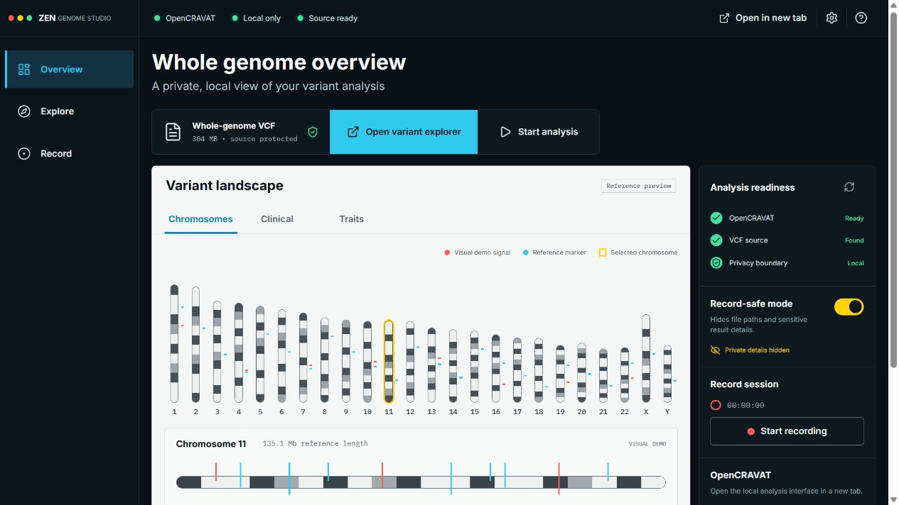

# Preston Genome Studio

A privacy-first visual wrapper for Preston's whole-genome OpenCRAVAT workflow. It runs locally with the real analysis status or on Cloudflare Pages as a safe visual preview. Raw genome files and personal results always stay outside the social-media project.



## Privacy boundary

- Raw genome files stay in the private Desktop DNA folder configured in `.env.local`.
- The private path exists only in `.env.local`, which Git ignores.
- The browser receives only a generic source name, availability, and file size.
- Genome files, result databases, jobs, recordings, logs, and local settings are blocked by `.gitignore`.
- The GitHub workflow fails if a genomic or analysis-data file is ever added to the repository.
- The Cloudflare build has no genome-upload endpoint and reports only that no private source is present.

## First-time setup

1. Open **Ubuntu** from the Start menu once.
2. Let it finish installing, then create the requested Linux username and password.
3. Open PowerShell in this project folder.
4. Run:

```powershell
powershell -ExecutionPolicy Bypass -File .\scripts\setup-opencravat.ps1
```

The setup uses an isolated Python environment in Ubuntu. It installs OpenCRAVAT, the GRCh38 base reference data, ClinVar, ClinVar ACMG, dbSNP, gnomAD 4, GWAS Catalog, PharmGKB, REVEL, SIFT, PolyPhen-2, Excel/TSV reporting, and matching viewer widgets. The base install alone downloads about 2 GB; the full module set needs additional disk space and time.

## Start and stop

Start both the recording wrapper and OpenCRAVAT:

```powershell
powershell -ExecutionPolicy Bypass -File .\scripts\start-all.ps1
```

Open these local pages:

- Recording wrapper: `http://127.0.0.1:4173/`
- OpenCRAVAT: `http://127.0.0.1:8080/`

Stop both local services:

```powershell
powershell -ExecutionPolicy Bypass -File .\scripts\stop-all.ps1
```

## VCF workflow

In OpenCRAVAT, choose the private source file directly from the Desktop folder. Select the correct genome assembly from the VCF header before starting the job. A full whole-genome annotation can run for hours and create large result files, so keep job output in OpenCRAVAT's private Ubuntu area rather than this repository.

The wrapper's **Clinical** and **Traits** views intentionally stay empty until real annotated results are available. The chromosome screen is labeled **Reference preview** and **Visual demo** so it cannot be mistaken for a medical finding.

## Screen-recording shot list

1. Open on **Whole genome overview** with **Record-safe mode** on.
2. Hold for two seconds on the chromosome landscape and select chromosomes 11, 17, and X.
3. Show the VCF status as **Found** without opening File Explorer.
4. Switch to **Clinical**, then **Traits**, and explain that personal results are never simulated.
5. Open OpenCRAVAT in a new tab and show the Jobs/Store interface without revealing local paths.
6. Return to the wrapper, start the recording timer, and end on **Nothing leaves this computer**.

For TikTok, crop the browser to the central landscape plus the right recording rail. Keep the OpenCRAVAT disclaimer visible when discussing variants: research and education only, not a diagnosis.

## GitHub

The public repository is [`prestonzen/zen-genome-studio`](https://github.com/prestonzen/zen-genome-studio). It contains application code and a reference preview only. It never contains Preston's genome or generated analysis results.

Before every push, review `git status` and never force-add ignored files. Contributions are welcome under the [MIT License](LICENSE), but issues and pull requests must not include genomic data, personal findings, or private file paths. See [CONTRIBUTING.md](CONTRIBUTING.md) and [SECURITY.md](SECURITY.md).

## Cloudflare Pages

Cloudflare hosts the recording-friendly interface and one tiny status Function. It does **not** run OpenCRAVAT and does not receive the VCF.

Preview the Cloudflare build locally:

```powershell
npm run preview:cloudflare
```

Deploy after signing in to Wrangler:

```powershell
npx wrangler login
npm run deploy:cloudflare
```

The deployment creates a `pages.dev` site. Pages sites are public unless access controls are added, so deploy only the code-only cloud preview. See [CLOUDFLARE.md](CLOUDFLARE.md) for the architecture, platform limits, and the later private-server migration path.

## Development

```powershell
npm install
npm run dev
```

Checks:

```powershell
npm run lint
npm run build
```
